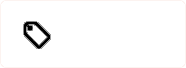
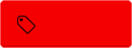
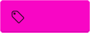
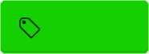

# Github contributions

Issue labels for oss-project collaboration on GitHub for [iGitScor's open source projects](https://github.com/iGitScor?tab=repositories)

## Issue labels

### Global statuses

#### Need a contributor


This status indicates that no one has already started to wok on this issue or the issue contains a checklist for multi contributors.

#### Duplicate


This status indicated that the ticker concerns an issue which has been already submitted. Check in previous issue if your problem is already submitted.

#### Invalid


This status indicates that the issue does not respect guidelines and should be modified.

##### Bad example

```md

It doesn't work.

```

##### Good example

```md

Hi folks,

I've encoutered an issue using the `master` version of the projects

0. Step 1
0. Step 2
0. Step 3

Thank you for your great work and for the upcoming help

```

#### Wontfix



____

### Workflow

#### Work in progress


#### Pending


#### Testing


#### Don't merge



____

### Kind of Issue

#### Bug


#### Question


#### Design


#### Documentation


____

### Kind of work

#### Enhancement


#### Infrastructure


#### Accessibility



#### Performance


____

### Work amount

#### Little work



#### Medium work


####  Much work


____

### Skill level

#### Beginner


#### Intermediate


#### Advanced


