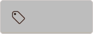

# Github contributions

## Table of contents

0. [Issue labels](#issue-labels)
0. [Code of conduct](#code-of-conduct)

## Issue labels

Issue labels for oss-project collaboration on GitHub for [iGitScor's open source projects](https://github.com/iGitScor?tab=repositories)

### Global statuses

#### Need a contributor


This status indicates that no one has already started to wok on this issue or the issue contains a checklist for multi contributors.

_**Hexa code: #000000**_

#### Duplicate


This status indicated that the ticker concerns an issue which has been already submitted. Check in previous issue if your problem is already submitted.

_**Hexa code: #808080**_

#### Invalid



This status indicates that the issue does not respect guidelines and should be modified.

_**Hexa code: #BDBDBD**_

##### Bad example

```md

It doesn't work.

```

##### Good example

```md

Hi folks,

I've encoutered an issue using the `master` version of the projects

0. Step 1
0. Step 2
0. Step 3

Thank you for your great work and for the upcoming help

```

#### Wontfix


_**Hexa code: #FFFFFF**_

____

### Workflow

#### Work in progress


_**Hexa code: #F3CA00**_

#### Pending


_**Hexa code: #F5AC00**_

#### Testing


_**Hexa code: #F4830**_

#### Don't merge


_**Hexa code: #F50000**_

____

### Kind of Issue

#### Bug


_**Hexa code: #C28399**_

#### Question


_**Hexa code: #94284E**_

#### Design


_**Hexa code: #C68F68**_

#### Documentation


_**Hexa code: #90C770**_

____

### Kind of work

#### Enhancement


_**Hexa code: #8307C0**_

#### Infrastructure


_**Hexa code: #460461**_

#### Accessibility


_**Hexa code: #F806C5**_

#### Performance


_**Hexa code: #D7264A**_

____

### Work amount

#### Little work


_**Hexa code: #15D000**_

#### Medium work


_**Hexa code: #94CC73**_

####  Much work


_**Hexa code: #7BCDA0**_

____

### Skill level

#### Beginner


_**Hexa code: #0509C3**_

#### Intermediate


_**Hexa code: #0967C3**_

#### Advanced


_**Hexa code: #4089C2**_

## Code of conduct

Refer to [contributor covenant document](http://contributor-covenant.org/version/1/4/code_of_conduct.md)

### Pledge

In the interest of fostering an open and welcoming environment, we as
contributors and maintainers pledge to making participation in our project and
our community a harassment-free experience for everyone, regardless of age, body
size, disability, ethnicity, gender identity and expression, level of experience,
nationality, personal appearance, race, religion, or sexual identity and
orientation.

### Standards

Examples of behavior that contributes to creating a positive environment
include:

* Using welcoming and inclusive language
* Being respectful of differing viewpoints and experiences
* Gracefully accepting constructive criticism
* Focusing on what is best for the community
* Showing empathy towards other community members

Examples of unacceptable behavior by participants include:

* The use of sexualized language or imagery and unwelcome sexual attention or
advances
* Trolling, insulting/derogatory comments, and personal or political attacks
* Public or private harassment
* Publishing others' private information, such as a physical or electronic
  address, without explicit permission
* Other conduct which could reasonably be considered inappropriate in a
  professional setting
